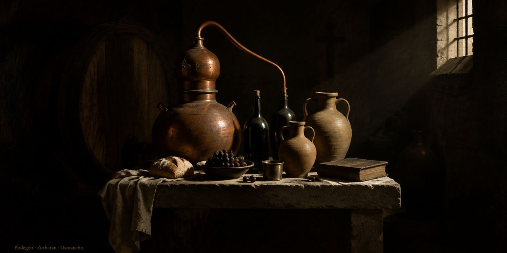

[Lobby](https://github.com/osmancitov/osmancitov.github.io/blob/main/README.md) · **Destilería** · [Taller](https://github.com/osmancitov/taller/blob/main/README.md) · [Journal](https://github.com/osmancitov/journal/blob/main/README.md)

# Destilería Osmancito

Aquí se destilan los grandes textos. Se toma un libro entero y se le quita lo que sobra, hasta que queda el hueso: lo que no se puede reducir más sin perder la semilla. De ahí sale algo que cabe en la mano y que se puede contar a otro.

La casa tiene dos cuartos.

## Protocolos

Los instrumentos con los que se lee: quince, cada uno con su filo, y las convenciones que comparten. Es el lugar de donde se parte, y el manual que se abre antes de operar.

[Entrar a los protocolos](protocolos/README.md)

## Bodega 2603

Los lotes terminados, guardados con su portada. Cada uno es un libro ya destilado, listo para abrirse y leerse.

[Entrar a la Bodega 2603](bodega-2603/README.md)
