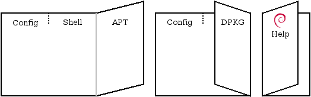

# Aprendiendo Debian

Cuaderno de estudio de la [Debian Reference (version 2.100)](https://packages.debian.org/bookworm/debian-reference)
Manual de usuario de [Debian 12 (Bookworm)](https://packages.debian.org/bookworm/) 

de [Osamu Aoki](https://salsa.debian.org/osamu) (青木 修).

---
# Prefacio

## 1. Aviso

El sistema Debian es un blanco móvil (moving target): mantener la documentación al día es difícil. Este manual se escribió sobre la versión testing del momento, así que algún detalle puede llegar ya viejo cuando lo leas.

## 2. Qué es Debian

El Debian Project es una asociación de personas unidas por una causa común: crear un sistema operativo libre. Su sello: compromiso con la libertad del software (el Debian Social Contract y las DFSG), esfuerzo voluntario distribuido por internet y sin paga, gran cantidad de paquetes precompilados de alta calidad, foco en estabilidad y seguridad con actualizaciones de seguridad fáciles, upgrades suaves hacia los paquetes más nuevos del archivo testing, y soporte para muchas arquitecturas de hardware.

## 3. Sobre este documento

### 3.1. Principios rectores

Las reglas que siguió el autor: panorama general y nada de casos raros (big picture), KISS (keep it short and simple), no reinventar la rueda (apuntar a las referencias que ya existen), herramientas de consola y no gráficas (ejemplos con shell), y objetividad (datos del popcon).

### 3.2. Prerrequisitos

Este documento solo da puntos de partida eficientes; las respuestas las busca uno mismo, en las fuentes primarias: el sitio https://www.debian.org, el directorio /usr/share/doc/ de tu propio sistema, Wikipedia, el Debian Administrator's Handbook (https://www.debian.org/doc/manuals/debian-handbook/) y TLDP (http://tldp.org/).

> 🐍 También se mencionan otras fuentes de información e investigación. Quizás sería bueno incluirlas y tener en el cuaderno un compendio de (todas? las mejores?) fuentes como: 

> 🐍 The Unix style **manpage**: "`dpkg -L package_name |grep '/man/man.*/'`"

> 🐍 The GNU style **info page**: "`dpkg -L package_name |grep '/info/'`"

> 🐍 The bug report: [http://bugs.debian.org/*package\_name*](https://bugs.debian.org/)

> 🐍 The Debian Wiki at <https://wiki.debian.org/> for the moving and specific topics

### 3.3. Convenciones

Convención de los ejemplos: `#` delante del comando significa que se ejecuta en la cuenta root; `$` significa cuenta de usuario normal.

---
# Tarjeta de referencia de Debian

La **refcard** es la tarjeta de referencia del Debian Documentation Project (DDP): una hoja con seis columnas, tres por cara, hecha para imprimir y plegar. El manual explica; la tarjeta deja a mano los comandos para consultar ayuda, configurar el sistema y manejar paquetes.

El pliegue también ordena la lectura. Primero se dobla el tercio derecho hacia la marca entre el izquierdo y el central; después, el izquierdo sobre el derecho. La portada debe quedar delante y el aviso de licencia detrás. El diagrama muestra cómo se acomodan los paneles:

Fuente del diagrama y de la tarjeta: [repositorio refcard en Salsa](https://salsa.debian.org/ddp-team/refcard), bajo licencia GPL-3 o posterior. Allí viven el texto en DocBook XML y los archivos para producir el folleto: `entries.dbk` contiene los comandos; `refcard.dbk`, la presentación y las instrucciones de plegado.

La fuente actual corresponde a Debian 13 (Trixie). Este cuaderno sigue estudiando Debian 12 (Bookworm): conviene tener presente esa diferencia al consultar la tarjeta.
